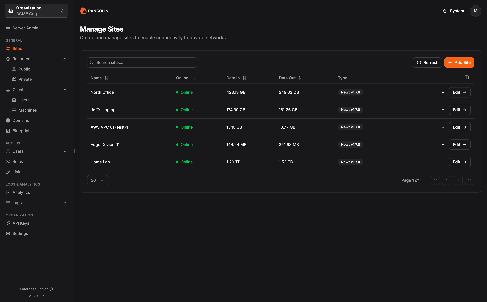

    <h2>
    <a href="https://pangolin.net/">
        <picture>
            <source media="(prefers-color-scheme: dark)" srcset="public/logo/word_mark_white.png">
            
        </picture>
    </a>
    </h2>

  <h5>
      <a href="https://pangolin.net/">
        Website
      </a>
       | 
      <a href="https://docs.pangolin.net/">
        Documentation
      </a>
       | 
      <a href="mailto:contact@pangolin.net">
        Contact Us
      </a>
  </h5>

    <strong>
        Start testing Pangolin at <a href="https://app.pangolin.net/auth/signup">app.pangolin.net</a>
    </strong>

Pangolin is a self-hosted tunneled reverse proxy server with identity and context aware access control, designed to easily expose and protect applications running anywhere. Pangolin acts as a central hub and connects isolated networks — even those behind restrictive firewalls — through encrypted tunnels, enabling easy access to remote services without opening ports or requiring a VPN.

## Installation

Check out the [quick install guide](https://docs.pangolin.net/self-host/quick-install) for how to install and set up Pangolin.

## Deployment Options

|  | Description |
|-----------------|--------------|
| **Self-Host: Community Edition** | Free, open source, and licensed under AGPL-3. |
| **Self-Host: Enterprise Edition** | Licensed under Fossorial Commercial License. Free for personal and hobbyist use, and for businesses earning under \$100K USD annually. |
| **Pangolin Cloud** | Fully managed service with instant setup and pay-as-you-go pricing — no infrastructure required. Or, self-host your own [remote node](https://docs.pangolin.net/manage/remote-node/nodes) and connect to our control plane. |

## Key Features

Pangolin packages everything you need for seamless application access and exposure into one cohesive platform.

|                                                                                                                                                                                                                                                                                                                                                                 |                                                   |
|----------------------------------------------------------------------------------------------------------------------------------------------------------------------------------------------------------------------------------------------------------------------------------------------------------------------------------------------------------------------------------|--------------------------------------------------------------------|
| **Manage applications in one place**   Pangolin provides a unified dashboard where you can monitor, configure, and secure all of your services regardless of where they are hosted.                                                                                                                                                                                    | <tr></tr> |
| **Reverse proxy across networks anywhere**  Route traffic via tunnels to any private network. Pangolin works like a reverse proxy that spans multiple networks and handles routing, load balancing, health checking, and more to the right services on the other end.                                                                                                  | <tr></tr>          |
| **Enforce identity and context aware rules**  Protect your applications with identity and context aware rules such as SSO, OIDC, PIN, password, temporary share links, geolocation, IP, and more.                                                                                                                                                                                                | <tr></tr>               |
| **Quickly connect Pangolin sites**  Pangolin's lightweight [Newt](https://github.com/fosrl/newt) client runs in userspace and can run anywhere. Use it as a site connector to route traffic to backends across all of your environments.                                                                                                                                                                                   | <tr></tr>               |

## Get Started

### Check out the docs

We encourage everyone to read the full documentation first, which is
available at [docs.pangolin.net](https://docs.pangolin.net). This README provides only a very brief subset of
the docs to illustrate some basic ideas.

### Sign up and try now

For Pangolin's managed service, you will first need to create an account at
[app.pangolin.net](https://app.pangolin.net). We have a generous free tier to get started.

## Licensing

Pangolin is dual licensed under the AGPL-3 and the [Fossorial Commercial License](https://pangolin.net/fcl.html). For inquiries about commercial licensing, please contact us at [contact@pangolin.net](mailto:contact@pangolin.net).

## Contributions

Please see [CONTRIBUTING](./CONTRIBUTING.md) in the repository for guidelines and best practices.
