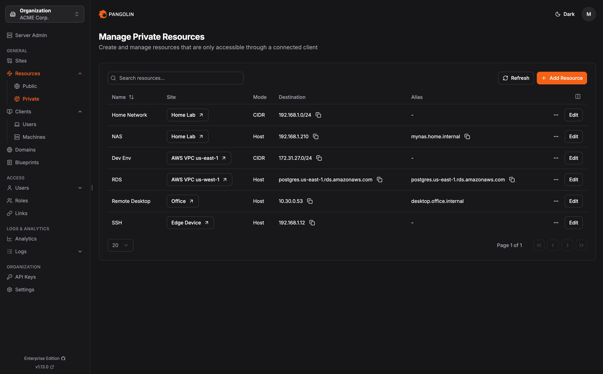
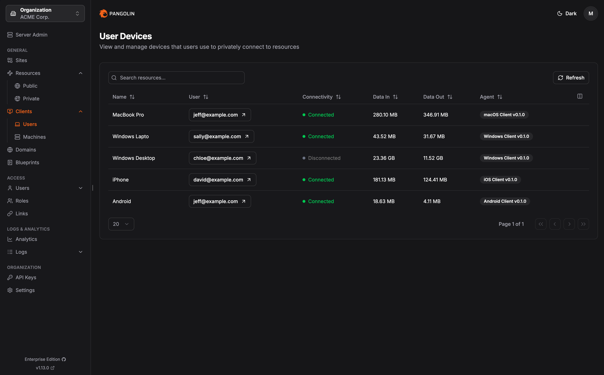

    <h2>
    <a href="https://pangolin.net/">
        <picture>
            <source media="(prefers-color-scheme: dark)" srcset="public/logo/word_mark_white.png">
            
        </picture>
    </a>
    </h2>

  <h5>
      <a href="https://pangolin.net/">
        Website
      </a>
       | 
      <a href="https://docs.pangolin.net/">
        Documentation
      </a>
       | 
      <a href="mailto:contact@pangolin.net">
        Contact Us
      </a>
  </h5>

    <strong>
        Start testing Pangolin at <a href="https://app.pangolin.net/auth/signup">app.pangolin.net</a>
    </strong>

Pangolin is an open-source, identity-based remote access platform built on WireGuard that enables secure, seamless connectivity to private and public resources. Pangolin combines reverse proxy and VPN capabilities into one platform, providing browser-based access to web applications and client-based access to private resources like databases and SSH servers, all with zero-trust security and granular access control.

## Installation

- Check out the [quick install guide](https://docs.pangolin.net/self-host/quick-install) for how to install and set up Pangolin.
- Install from the [DigitalOcean marketplace](https://marketplace.digitalocean.com/apps/pangolin-ce-1?refcode=edf0480eeb81) for a one-click pre-configured installer.

## Deployment Options

|  | Description |
|-----------------|--------------|
| **Self-Host: Community Edition** | Free, open source, and licensed under AGPL-3. |
| **Self-Host: Enterprise Edition** | Licensed under Fossorial Commercial License. Free for personal and hobbyist use, and for businesses earning under \$100K USD annually. |
| **Pangolin Cloud** | Fully managed service with instant setup and pay-as-you-go pricing — no infrastructure required. Or, self-host your own [remote node](https://docs.pangolin.net/manage/remote-node/nodes) and connect to our control plane. |

## Key Features

|                                                                                                                                                                                                                                                                                                                                                                 |                                                   |
|----------------------------------------------------------------------------------------------------------------------------------------------------------------------------------------------------------------------------------------------------------------------------------------------------------------------------------------------------------------------------------|--------------------------------------------------------------------|
| **Connect remote networks with sites**  Pangolin's lightweight site connectors create secure tunnels from remote networks without requiring public IP addresses or open ports. Sites make any network anywhere available for authorized access.                                                                                                                                                                                   | <tr></tr>               |
| **Browser-based reverse proxy access**  Expose web applications through identity and context-aware tunneled reverse proxies. Pangolin handles routing, load balancing, health checking, and automatic SSL certificates without exposing your network directly to the internet. Users access applications through any web browser with authentication and granular access control.                                                                                                  | <tr></tr>          |
| **Client-based private resource access**  Access private resources like SSH servers, databases, RDP, and entire network ranges through Pangolin clients. Intelligent NAT traversal enables connections even through restrictive firewalls, while DNS aliases provide friendly names and fast connections to resources across all your sites.                                                                                                                                                                                                | <tr></tr>               |
| **Zero-trust granular access**  Grant users access to specific resources, not entire networks. Unlike traditional VPNs that expose full network access, Pangolin's zero-trust model ensures users can only reach the applications and services you explicitly define, reducing security risk and attack surface.                                                                                                                                                                                    | <tr></tr> |

## Download Clients

Download the Pangolin client for your platform:

- [Mac](https://pangolin.net/downloads/mac)
- [Windows](https://pangolin.net/downloads/windows)
- [Linux](https://pangolin.net/downloads/linux)

## Get Started

### Check out the docs

We encourage everyone to read the full documentation first, which is
available at [docs.pangolin.net](https://docs.pangolin.net). This README provides only a very brief subset of
the docs to illustrate some basic ideas.

### Sign up and try now

For Pangolin's managed service, you will first need to create an account at
[app.pangolin.net](https://app.pangolin.net). We have a generous free tier to get started.

## Licensing

Pangolin is dual licensed under the AGPL-3 and the [Fossorial Commercial License](https://pangolin.net/fcl.html). For inquiries about commercial licensing, please contact us at [contact@pangolin.net](mailto:contact@pangolin.net).

## Contributions

Please see [CONTRIBUTING](./CONTRIBUTING.md) in the repository for guidelines and best practices.

---

WireGuard® is a registered trademark of Jason A. Donenfeld.
